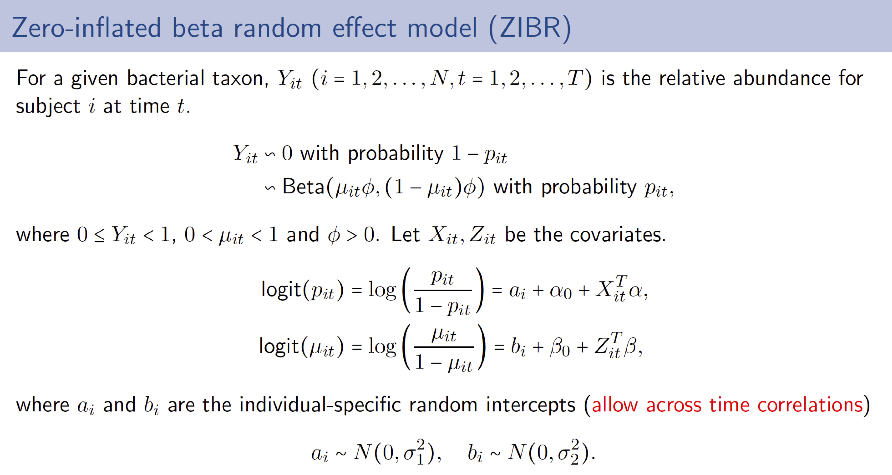

# ZIBR (Zero-Inflated Beta Random Effect model)

## Introduction
The longitudinal microbiome compositional data are highly skewed, bounded in [0,1), and often sparse with many zeros. In addition, the observations from repeated measures are correlated. We propose a two-part zero-inflated Beta regression model with random effects (ZIBR) for testing the association between microbial abundance and clinical covariates for longitudinal microbiome data. The model includes a logistic component to model presence/absence of the microbe in samples and a Beta component to model non-zero microbial abundance and each component includes a random effect to take into account the correlation among repeated measurements on the same subject.

The details of the statistical model are as follows:


The ZIBR model combines the logistic regression and Beta regression in one model. Each regression part includes random effects to account for correlations acorss time points. We call these two regressions in ZIBR model as logistic component and Beta component. These two components model two different aspects of the data. The logistic component models presence/absence of the microbe and Beta component models non-zero microbial abundance.

Accordingly, we can test three biologically relevant null hypotheses:  
- H0: α_j = 0.  This is to test the coefficients in the logistic component, if the covariates are associated with the bacterial taxon by affecting its presence or absence;  
- H0: β_j = 0.  This is to test the coefficients in the Beta component, if the taxon is associated with the covariates by showing different abundances;  
- H0: α_j = 0 and β_j = 0 for each covariate X_j and Z_j. This is to joinly test the coefficients in both logistic and Beta components, if the covariates affect the taxon both in terms of presence/absence and its non-zero abundance.  

## Installation
You can install our ZIBR package from Github
```r
install.packages("devtools")
devtools::install_github("chvlyl/ZIBR")
library(ZIBR)
```

## Basic Usage

```r
zibr(logistic.cov=logistic.cov,beta.cov=beta.cov,Y=Y,subject.ind=subject.ind,time.ind=time.ind)
```

- **logistic.cov**: covariates for the logistic component. Rows: samples. Columns: covariates.  
- **beta.cov**: covariates for the Beta component. Rows: samples. Columns: covariates.  
- **Y**: the response variable (i.e the bacterial relative abundance). It is a vector with values in [0,1).  
- **subject.ind**: the variable with subject IDs.   
- **time.ind**: the variable with time points.   

The ordering of the samples in the above matrix or vectors must be consistent. 

The zibr function will return the following results:
- **logistic.est.table**: the estimated coefficients for logistic component.  
- **logistic.s1.est**: the estimated standard deviation for the random effect in the logistic component.  
- **beta.est.table**: the estimated coefficients for Beta component.  
- **beta.s2.est**: the estimated standard deviation for the random effect in the Beta component.  
- **beta.v.est**: the estiamted dispersion parameter in the Beta component.  
- **joint.p**: the pvalues for jointly testing each covariate in both logistic and Beta component.  

## Examples

#### Simulated data  
The following function will simulate some data according to the zero-inflated beta random effect model. We specify the covariates in the logistic component (X) and covariates in the Beta component (Z) to be the same (i.e set Z=X).

```r
sim <- simulate_zero_inflated_beta_random_effect_data(
    subject.n=100,time.n=5,
    X = as.matrix(c(rep(0,50*5),rep(1,50*5))),
    Z = as.matrix(c(rep(0,50*5),rep(1,50*5))),
    alpha = as.matrix(c(-0.5,1)),
    beta = as.matrix(c(-0.5,0.5)),
    s1 = 1,s2 = 0.8,
    v = 5,
    sim.seed=100)
```

The simulation function returns the the bacterial abundance (Y) simulated according to the above parameter settings. This function also returns the other variables such as X, Z, alpha, beta etc. that we just specified. It also returns two variables subject.ind and time.ind, which are subject IDs and time points for each subject.


We can run the zibr function to fit the zero-inflated beta random effect model on the simulated data.
```r
zibr.fit <- zibr(logistic.cov = sim$X, beta.cov = sim$Z, Y = sim$Y,
    subject.ind = sim$subject.ind,time.ind = sim$time.ind)
zibr.fit
```

If we use the same covariates for logistic and beta components, ZIBR can jointly test the covariate in both components. In the following example, we use the same covariate X in both components. We can obtain the ```joint.p``` as the pvalues of the joint test.  

```r
zibr.fit <- zibr(logistic.cov = sim$X, beta.cov = sim$X, Y = sim$Y,
    subject.ind = sim$subject.ind,time.ind = sim$time.ind)
zibr.fit
```

#### Real data  
Let's try anohter example on the real data. I will use a dataset from a longitudinal human microbiome study containing the bacterial abundance and clinical information from [Lewis and Chen et al.](http://www.cell.com/cell-host-microbe/references/S1931-3128(15)00377-7). I only include the abundance from one genus.   

Type ```ibd.data```.
```r
     Sample Subject Time Treatment    Abundance
1   5001-01    5001    1         0 0.000000e+00
2   5001-02    5001    2         0 0.000000e+00
3   5001-03    5001    3         0 0.000000e+00
4   5001-04    5001    4         0 0.000000e+00
5   5002-01    5002    1         0 3.961764e-03
6   5002-02    5002    2         0 1.008613e-02
7   5002-03    5002    3         0 0.000000e+00
8   5002-04    5002    4         0 0.000000e+00
9   5003-01    5003    1         0 2.545083e-03
10  5003-02    5003    2         0 6.901096e-03
11  5003-03    5003    3         0 3.038140e-04
12  5003-04    5003    4         0 1.739832e-02
13  5006-01    5006    1         0 2.052549e-03
14  5006-02    5006    2         0 4.636235e-04
15  5006-03    5006    3         0 3.403491e-04
16  5006-04    5006    4         0 2.840756e-03
17  5007-01    5007    1         0 1.634215e-03
18  5007-02    5007    2         0 1.061013e-03
19  5007-03    5007    3         0 5.522727e-05
20  5007-04    5007    4         0 1.986368e-01
...
...
```

Note that each subject has four time points. In the Treatment column, 0 is for antiTNF treatment and 1 is for EEN treatment. Abundance column is the relative abundance for Eubacterium. The abudance is in the range of [0,1).  


The current model can not handle missing data. That is, each subject must have the same number of time points. If any time point is missing in your data, you can (1) remove some other time points so that all subject have the same time points (2) impute the missing data, for example, use the mean or median value from other subjects at the same time point in the same covariate group to replace the missing value. I'm currently working on the missing data problem and hope that our model can handle missing data soon.

We can run the zibr function to the real data. Here, I'm interested in comparing the two treatments and use treatment as the only covariate in both logistic and beta component. Depending on the scientific questions you are interested in, you can also include time and treament-time interaction in the covariates. 

```r
zibr.fit <- zibr(logistic.cov = data.frame(Treatment=ibd.data$Treatment), 
    beta.cov = data.frame(Treatment=ibd.data$Treatment), 
    Y = ibd.data$Abundance, subject.ind = ibd.data$Subject,
    time.ind = ibd.data$Time)
zibr.fit
```

Neither of the logsitic or beta component show significant pvalues. This indicates the abundance of this genus is not different between the two treatments, considering all time points.


#### Real data (reproduce the analysis in my Bioinformatics paper)

```r
### Load the raw data
PLEASE.file <- "https://raw.githubusercontent.com/chvlyl/PLEASE/master/1_Data/Raw_Data/MetaPhlAn/PLEASE/G_Remove_unclassfied_Renormalized_Merge_Rel_MetaPhlAn_Result.xls"
PLEASE.raw <- read.table(PLEASE.file,sep='\t',header=TRUE,row.names = 1,
                         check.names=FALSE,stringsAsFactors=FALSE)
taxa.raw <- t(PLEASE.raw)

### Make sure you load the data correctly
cat('samples','taxa',dim(taxa.raw),'\n')
taxa.raw[1:3,1:3]

### Load total non-human read counts
human.read.file <- 'https://raw.githubusercontent.com/chvlyl/PLEASE/master/1_Data/Raw_Data/MetaPhlAn/Human_Reads/please_combo_human_reads.xls'
human.read <- read.table(human.read.file,sep='\t',header=TRUE,
                         row.names=1,stringsAsFactors=FALSE)

### Filter low depth samples (low non human reads)
low.depth.samples <- subset(human.read,NonHumanReads<10000)
low.depth.samples[,1:5]

### Delete these samples from PLEASE data.
rownames(taxa.raw)[which(rownames(taxa.raw) %in% rownames(low.depth.samples))]

### Before deletion
dim(taxa.raw)

### After deletion
taxa.raw <- taxa.raw[-which(rownames(taxa.raw) %in% rownames(low.depth.samples)),]
dim(taxa.raw)


### Filter low abundant bacterial data
filter.index1 <- apply(taxa.raw,2,function(X){sum(X>0)>0.4*length(X)})
filter.index2 <- apply(taxa.raw,2,function(X){quantile(X,0.9)>1})
taxa.filter <- taxa.raw[,filter.index1 & filter.index2]
taxa.filter <- 100*sweep(taxa.filter, 1, rowSums(taxa.filter), FUN="/")
cat('after filter:','samples','taxa',dim(taxa.filter),'\n')
cat(colnames(taxa.filter),'\n')
head(rowSums(taxa.filter))

### 
taxa.data <- taxa.filter
dim(taxa.data)


#### Load sample information
sample.info.file <- 'https://raw.githubusercontent.com/chvlyl/PLEASE/master/1_Data/Processed_Data/Sample_Information/2015_02_13_Processed_Sample_Information.csv'
sample.info <- read.csv(sample.info.file,row.names=1)


#### create covariates, 
#### Time, antiTNF+EEN
reg.cov <-
  data.frame(Sample=rownames(taxa.data),stringsAsFactors = FALSE) %>% 
  left_join(add_rownames(sample.info,var = 'Sample'),by='Sample')%>%
  dplyr::filter(Treatment.Specific!='PEN') %>%
  dplyr::select(Sample,Time,Subject,Response,Treatment.Specific) %>%
  group_by(Subject) %>% summarise(count = n()) %>% dplyr::filter(count==4) %>%
  dplyr::select(Subject) %>%
  left_join(add_rownames(sample.info,var = 'Sample'),by='Subject') %>%
  mutate(Treat=ifelse(Treatment.Specific=='antiTNF',1,0)) %>%
  dplyr::select(Sample,Subject,Time,Response,Treat) %>%
  dplyr::mutate(Subject=paste('S',Subject,sep='')) %>%
  dplyr::mutate(Time=ifelse(Time=='1',0,ifelse(Time=='2',1,ifelse(Time=='3',4,ifelse(Time=='4',8,NA))))) %>%
  dplyr::mutate(Time.X.Treatment=Time*Treat) %>%
  as.data.frame

### take out first time point
reg.cov.t1   <-  subset(reg.cov,Time==0)
rownames(reg.cov.t1) <- reg.cov.t1$Subject
reg.cov.t234 <-  subset(reg.cov,Time!=0)
reg.cov.t234 <- data.frame(
  baseline.sample=reg.cov.t1[reg.cov.t234$Subject,'Sample'],
  baseline.subject=reg.cov.t1[reg.cov.t234$Subject,'Subject'],
  reg.cov.t234,
  stringsAsFactors = FALSE)
  
#### Fit ZIBR model on the real data
spe.all <- colnames(taxa.data)
p.species.list.zibr <- list()
p.species.list.lme <- list()
for (spe in spe.all){
  #spe = 'g__Collinsella'
  ###### create covariates
  X <- data.frame(
    Baseline=taxa.data[reg.cov.t234$baseline.sample, spe]/100,
    #reg.cov.t234[,c('log.days','Delivery','Delivery.X.log.days')]
    reg.cov.t234[,c('Time','Treat')]
  )
  rownames(X) <- reg.cov.t234$Sample
  Z <- X
  subject.ind <- reg.cov.t234$Subject
  time.ind   <- reg.cov.t234$Time
  ####
  cat(spe,'\n')
  Y <- taxa.data[reg.cov.t234$Sample, spe]/100
  cat('Zeros/All',sum(Y==0),'/',length(Y),'\n')
  ####################
  ## fit linear random effect model with arcsin square transformation on Y
  tdata <- data.frame(Y.tran=asin(sqrt(Y)),X,SID=subject.ind)
  lme.fit <- lme(Y.tran ~ Baseline + Time + Treat,random=~1| SID, data = tdata)
  coef.mat <- summary(lme.fit)$tTable[-1,c(1,5)]
  p.species.list.lme[[spe]] <- coef.mat[,2]
  ###################
  if (sum(Y>0)<10 | sum(Y==0) <10 | max(Y)<0.01){
    print('skip')
    p.species.list.zibr[[spe]] <- p.species.list.lme[[spe]]
    next
  }else{
    est <- zibr(logistic.cov=X,beta.cov=Z,Y=Y,
                 subject.ind=subject.ind,
                 time.ind=time.ind,
                 quad.n=30,verbose=TRUE)
    p.species.list.zibr[[spe]] <- est$joint.p
    
  }
  #break
}


#### adjust p values
p.species.zibr <- t(as.data.frame(p.species.list.zibr))
p.species.zibr.adj <-
  add_rownames(as.data.frame(p.species.zibr),var = 'Species') %>% mutate_each(funs(p.adjust(.,'fdr')),-Species)

write.csv(p.species.zibr.adj,file=paste('../4_Results/Real_Data_Estimation_Results_antiTNF_EEN_ZIBR.csv',sep=''))


p.species.lme <- t(as.data.frame(p.species.list.lme))
p.species.lme.adj <-  
  add_rownames(as.data.frame(p.species.lme),var = 'Species') %>% mutate_each(funs(p.adjust(.,'fdr')),-Species)

write.csv(p.species.lme.adj,file=paste('../4_Results/Real_Data_Estimation_Results_antiTNF_EEN_LME.csv',sep=''))

####
intersect(p.species.lme.adj[p.species.lme.adj$Treat<0.05,'Species'],
          p.species.zibr.adj[p.species.zibr.adj$Treat<0.05,'Species'])
setdiff(p.species.lme.adj[p.species.lme.adj$Treat<0.05,'Species'],
        p.species.zibr.adj[p.species.zibr.adj$Treat<0.05,'Species'])
setdiff(p.species.zibr.adj[p.species.zibr.adj$Treat<0.05,'Species'],
        p.species.lme.adj[p.species.lme.adj$Treat<0.05,'Species'])

intersect(p.species.lme.adj[p.species.lme.adj$Time<0.05,'Species'],
          p.species.zibr.adj[p.species.zibr.adj$Time<0.05,'Species'])
setdiff(p.species.lme.adj[p.species.lme.adj$Time<0.05,'Species'],
        p.species.zibr.adj[p.species.zibr.adj$Time<0.05,'Species'])
setdiff(p.species.lme.adj[p.species.zibr.adj$Time<0.05,'Species'],
        p.species.zibr.adj[p.species.lme.adj$Time<0.05,'Species'])
```

## Missing values
If there are missing values in certain time points, they can be imputed as following:
1. Calculate the mean or median of values from previous time point(s) and later time points(s). Use such values to replace the missing values.
2. Group the time point with missing values with other time points. For example, if you have T1, T2, T3 and T4 and T1 has missing values, you can group T1 and T2 as one time point.

After the missing values are imputed, the data can be fed into ZIBR.

## Citation
Eric Z. Chen and Hongzhe Li (2016). A two-part mixed effect model for analyzing longitudinal microbiome data. Bioinformatics. [Link](http://bioinformatics.oxfordjournals.org/content/early/2016/05/14/bioinformatics.btw308.short?rss=1)

## Contact
Feel free to contact me (Eric Z. Chen) by chvlyl AT gmail.com

## Updates

<!---
- Add likelihood to the output.
- variable name is missing in beta.est.table
-->
